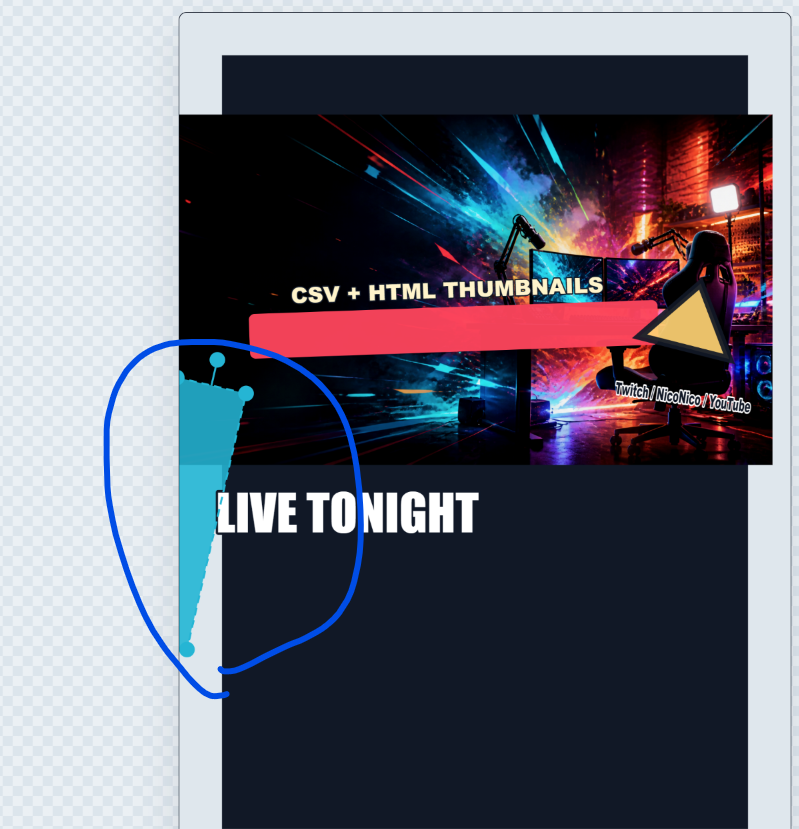

# キャンバス外要素の表示対応

- Status: closed
- Priority: P2
- Type: feature
- Source: local
- Draft source: codex-cli
- Phase: 03-design
- Created: 2026-06-06
- Closed: 2026-06-06
- QCDS: Quality, Satisfaction

## Context

編集画面でキャンバス外にはみ出したレイヤーや画像が見切れて表示されず、配置や調整がしづらい。編集時はキャンバス外のはみ出し部分も見えるようにする一方、画像出力時は従来どおりキャンバスサイズで出力し、範囲外が見切れる挙動を維持する。

## Acceptance Criteria

- [x] 編集画面でキャンバス外にはみ出した要素が見える状態で表示される
- [x] はみ出した要素も選択、移動、サイズ調整など既存のレイヤー編集操作ができる
- [x] 画像出力時はキャンバスサイズの範囲だけが出力され、キャンバス外の部分は含まれない
- [x] 既存のキャンバス内表示、レイヤー編集、エクスポート挙動に不要な regressions がない

## Attachments

## Notes

- `src/lib/previewPadding.ts` で表示中レイヤーの回転後外接範囲から編集用プレビュー余白を算出するようにした。
- 出力は従来どおり `previewPadding` なしのキャンバスで描画するため、キャンバス外部分はエクスポートに含まれない。

## Evidence

- `npm test`: pass. 17 test files, 44 tests.
- `npm run build`: pass.
- Runtime gate: `Cyan slash` を `x=-220` に移動後、編集キャンバスが `1918x1358` へ拡張され、同じレイヤーの回転ハンドル操作とWebP exportが通過した。
- Screenshot: `docs/assets/runtime-p2-work-items-desktop.png`

## Codex Sessions

- 2026-06-06T14:46:42.466Z `codex-session-20260606144642-2av7le` - All Work Items (VS Code Codex handoff); access=danger-full-access; model=gpt-5.5; intelligence=xhigh; [prompt](c:/Users/gkkjh/AppData/Roaming/Code/User/workspaceStorage/57ceaa8249d2f65368a0891ad39aa21f/sunmax0731.codex-friendly-project-starter/first-prompt-20260606T144642Z.md)
