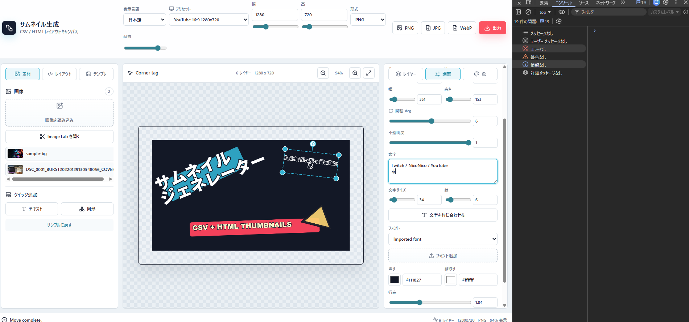
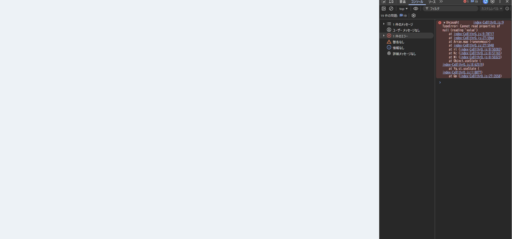

# 改行後の文字列編集で白画面になる不具合修正

- Status: closed
- Priority: P2
- Type: bug
- Source: local
- Draft source: codex-cli
- Phase: 03-design
- Created: 2026-06-07
- Closed: 2026-06-07
- QCDS: Quality, Satisfaction

## Context

Adjust タブのテキスト入力で改行後に続けて文字列を編集すると、React の state updater 内で synthetic event の `currentTarget` を遅延参照し、`Cannot read properties of null (reading 'value')` が発生して白画面になる経路があった。

## Acceptance Criteria

- [x] テキスト編集で Enter による改行後に追加入力しても画面が白くならない。
- [x] 開発者コンソールに `Cannot read properties of null (reading 'value')` が出力されない。
- [x] 改行を含むテキストレイヤーの編集内容がキャンバス表示と状態に反映される。
- [x] 該当操作を再現する回帰テストまたは手動検証手順が追加される。

## Attachments

## Resolution

- `InspectorPanel` の text/font/image/shape 変更ハンドラで、state updater を渡す前に入力値をローカル変数へ退避するよう修正した。
- Playwright runtime gate で `LINE ONE`, `LINE TWO`, `LINE THREE` の複数行編集を実行し、page error と console error がないことを確認した。

## Evidence

- `npm test`: pass, 20 files, 53 tests.
- `npm run build`: pass.
- Browser runtime gate: pass at `http://127.0.0.1:4174/thumbnail-generator/`.
- Screenshots: `docs/assets/runtime-backlog-20260607-desktop.png`, `docs/assets/runtime-backlog-20260607-mobile.png`.

## Notes

- Follow-up issue is not required.
