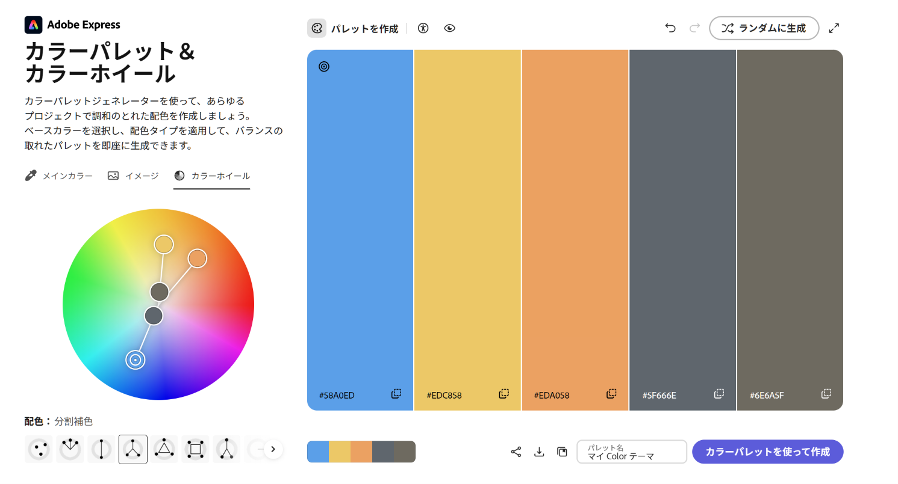

# パレット単位の色管理と適用GUI

- Status: closed
- Priority: P2
- Type: feature
- Source: local
- Draft source: codex-cli
- Phase: 03-design
- Created: 2026-06-07
- QCDS: Quality, Cost, Satisfaction

## Context

カラーパレット機能を、既存のグループとは別の「パレット」単位で管理できるようにする。表示中の色をまとめて登録し、登録済みパレットをGUIからすぐ参照して、選択中の図形などへ線色または塗り色として反映できるようにする。添付のカラーパレット・カラーホイール画像は参考イメージであり、GUIは完全追従しなくてもよい。

## Acceptance Criteria

- [x] 追加ボタンを押すと、現在表示中の色がすべて1つのパレットとして登録される。
- [x] 登録したパレットをすぐ参照できるGUIが追加され、パレット内の色一覧を表示できる。
- [x] パレット内の各色の横に線/塗りボタンが表示され、選択中の図形などの項目へ該当色を反映できる。
- [x] パレット作成または色選択時に、類似色3色、補色2色、分割補色3色、トライアド3色、スクエア4色、複合色3色、シェイド1色、モノクロマティック3色を選択できる。
- [x] 選択した種類に基づき、基準色を変更したときに他の各色が指定された色数と関係性で更新される。

## Attachments

## Completion Evidence

Implemented saved palette sets with selectable pattern modes and per-color Fill/Stroke application buttons.

- `npm test`: pass (21 files, 64 tests).
- `npm run build`: pass.
- Browser runtime gate: Playwright fallback pass at `http://127.0.0.1:4180/thumbnail-generator/` after Browser plugin returned `Browser is not available: iab`.
- Runtime exercised CSV import, HTML import, text editing, Google Fonts selection, vertical writing, signed edge blur, grouped-row individual editing, saved Square palette set application, YouTube thumbnail import, WebP export, and mobile no-overflow.
- Evidence screenshots: `docs/assets/runtime-final-open-p2-20260607-desktop.png`, `docs/assets/runtime-final-open-p2-20260607-mobile.png`.

## Notes

-

## Codex Sessions

- 2026-06-07T05:38:03.408Z `codex-session-20260607053803-17mwsj` - All Work Items (VS Code Codex handoff); access=danger-full-access; model=gpt-5.5; intelligence=high; [prompt](c:/Users/gkkjh/AppData/Roaming/Code/User/workspaceStorage/57ceaa8249d2f65368a0891ad39aa21f/sunmax0731.codex-friendly-project-starter/first-prompt-20260607T053803Z.md)
