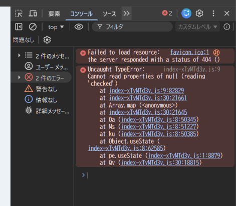

# 添付画像エラーの原因調査と修正

- Status: closed
- Priority: P2
- Type: feature
- Source: local
- Draft source: codex-cli
- Phase: 04-implementation
- Created: 2026-06-07
- QCDS: Quality, Satisfaction

## Context

添付画像で示されたエラーが発生しているため、原因を調査し、再発しない形で解決する。既存の指定により優先度はP2、種別はfeature、工程は実装として扱う。

## Acceptance Criteria

- [x] 添付画像のエラー内容から発生条件と原因が特定されている
- [x] 原因に対する修正が実装され、同じ操作でエラーが再現しない
- [x] 関連する既存機能に副作用がないことを確認している

## Completion Evidence

添付画像の主エラーは、Adjust タブの Blur stroke チェックボックス変更時に React イベントの `currentTarget` を state updater 内で参照し、後続実行時に `null.checked` になっていたこと。チェック状態をハンドラ内で先に取り出してから updater に渡す修正で再発を防止した。副次的な `favicon.ico` 404 は SVG favicon を追加して解消した。

- `npm test`: pass (22 files, 70 tests).
- `npm run build`: pass.
- Browser runtime gate: in-app Browser returned `Browser is not available: iab`; Playwright headless Chromium fallback passed at `http://127.0.0.1:4181/thumbnail-generator/`.
- Runtime exercised CSV import, HTML import, local image import, text layer editing, Vertical writing mode, Blur stroke toggle, Adobe-style Colors UI, saved palette creation, WebP export, and mobile no-overflow.
- Console/page/http health: no relevant console errors, no page errors, no HTTP 4xx/5xx.
- Evidence screenshots: `docs/assets/runtime-all-work-items-20260607-desktop.png`, `docs/assets/runtime-all-work-items-20260607-colors.png`, `docs/assets/runtime-all-work-items-20260607-mobile.png`.

## Attachments

## Notes

-

## Codex Sessions

- 2026-06-07T06:26:48.409Z `codex-session-20260607062648-8kuikq` - All Work Items (VS Code Codex handoff); access=danger-full-access; model=gpt-5.5; intelligence=high; [prompt](c:/Users/gkkjh/AppData/Roaming/Code/User/workspaceStorage/57ceaa8249d2f65368a0891ad39aa21f/sunmax0731.codex-friendly-project-starter/first-prompt-20260607T062648Z.md)
