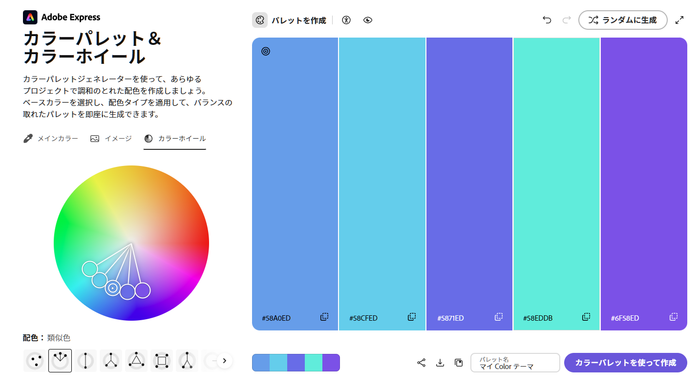
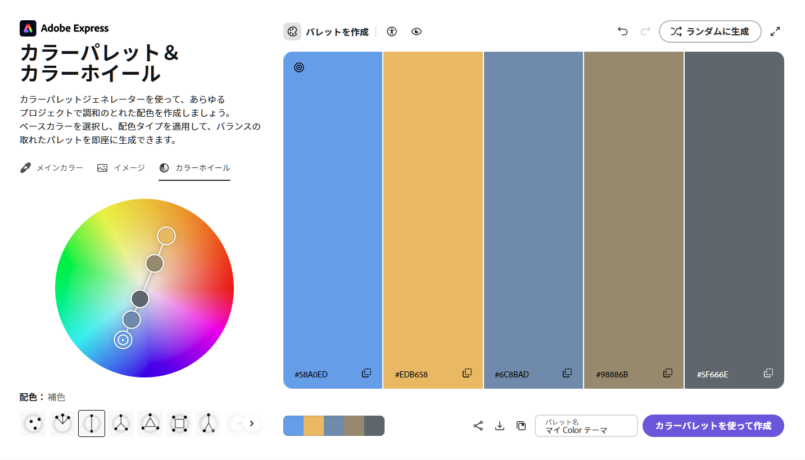
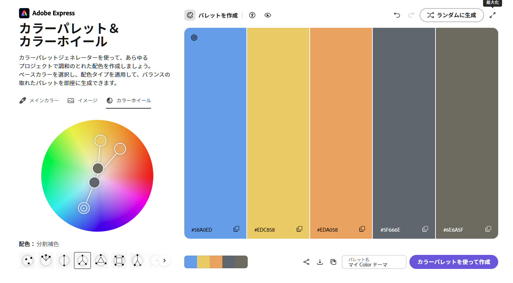
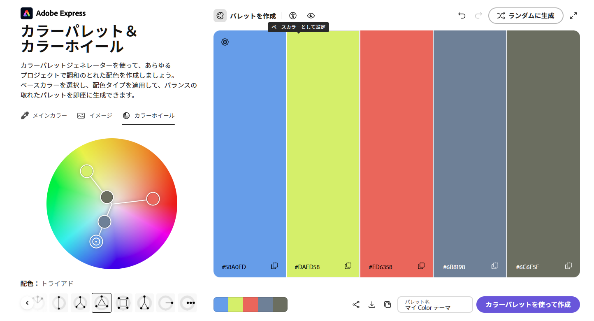
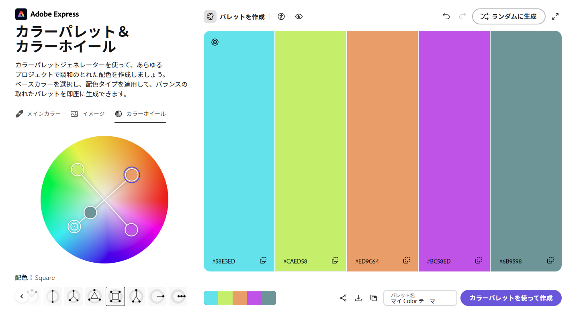

# Adobe風カラーパレットUI改修

- Status: closed
- Priority: P2
- Type: feature
- Source: local
- Draft source: codex-cli
- Phase: 03-design
- Created: 2026-06-07
- QCDS: Quality, Satisfaction

## Context

現在のカラーパレット機能は単色選択に限られており、サムネイル編集時の色調整や配色作業がしづらい。Adobe系ツールのGUIを参考に、色の探索、入力、再利用がしやすいパレットUIへ改修する。既存のレイヤー編集や画像 export の流れを壊さず、ブラウザ上で完結する静的WebAppとして実装する。

## Acceptance Criteria

- [x] カラーパレットUIで単色選択だけでなく、色相・彩度・明度などを視覚的に調整できる。
- [x] HEXまたはRGBなどの数値入力で色を指定でき、入力値とプレビュー表示が同期する。
- [x] 選択した色が既存のレイヤー編集対象に即時反映され、サムネイル出力にも反映される。
- [x] Adobe系GUIを参考にしたスウォッチ、最近使った色、または類似の再利用導線が用意されている。
- [x] 主要画面サイズでUIの表示崩れや操作不能がなく、既存テストとビルドが通る。

## Completion Evidence

Colors タブに、色相ホイール上の生成色ポイント、大きい配色バー、HEX/RGB 同期入力、最近使った色、保存済みパレットを統合した。色入力やホイール/バー/最近色の選択は、選択中の text/shape レイヤーへ Fill/Stroke target と opacity draft に合わせてプレビュー反映される。

- `npm test`: pass (22 files, 70 tests).
- `npm run build`: pass.
- Runtime gate: Playwright headless Chromium fallback passed after in-app Browser returned `Browser is not available: iab`.
- Palette UI evidence: 3 wheel points, 3 spectrum bars, 3 RGB inputs, 9 recent swatches, 1 saved palette row in the exercised run.
- Evidence screenshot: `docs/assets/runtime-all-work-items-20260607-colors.png`.

## Attachments

## Notes

-

## Codex Sessions

- 2026-06-07T06:26:48.409Z `codex-session-20260607062648-8kuikq` - All Work Items (VS Code Codex handoff); access=danger-full-access; model=gpt-5.5; intelligence=high; [prompt](c:/Users/gkkjh/AppData/Roaming/Code/User/workspaceStorage/57ceaa8249d2f65368a0891ad39aa21f/sunmax0731.codex-friendly-project-starter/first-prompt-20260607T062648Z.md)
