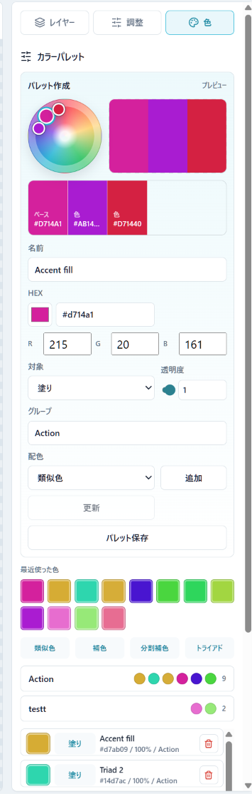

# カラーパレット操作と色グループ削除の改善

- Status: closed
- Priority: P2
- Type: feature
- Source: local
- Draft source: codex-cli
- Phase: 04-implementation
- Created: 2026-06-07
- QCDS: Quality, Satisfaction

## Context

カラーパレットの色変更操作をクリックだけでなくドラッグにも対応させ、カラーホイールクリック時の反映先や配色パターン連動を明確にする。あわせて、透明度スライダーの表示幅が小さい問題を改善し、色グループにも他の項目やオブジェクトと同様の削除操作を追加する。

## Acceptance Criteria

- [x] カラーパレット上でドラッグ操作により色を連続的に変更できる。
- [x] カラーホイール上の色をクリックしたとき、最後に選択した色ハンドルへその色が設定される。
- [x] 色を設定したタイミングで、現在選択中の配色パターンに応じた関連色が各対象へ反映される。
- [x] 透明度設定スライダーが実用上十分な幅で表示され、狭すぎて操作しづらい状態が解消される。
- [x] 色グループに削除機能が追加され、他の項目やオブジェクトと同様に削除できる。

## Attachments

## Notes

- Closed 2026-06-07. Added continuous color-wheel pointer drag, alpha-aware immediate preview, full-width opacity control, and color-group delete actions.
- Evidence: `npm test`, `npm run build`, and Playwright runtime gate at `http://127.0.0.1:4182/thumbnail-generator/`; screenshots in `docs/assets/runtime-colors-edge-gate-20260607-*.png`.

## Codex Sessions

- 2026-06-07T07:43:08.082Z `codex-session-20260607074308-ggvvmp` - All Work Items (VS Code Codex handoff); access=danger-full-access; model=gpt-5.5; intelligence=high; [prompt](c:/Users/gkkjh/AppData/Roaming/Code/User/workspaceStorage/57ceaa8249d2f65368a0891ad39aa21f/sunmax0731.codex-friendly-project-starter/first-prompt-20260607T074308Z.md)
