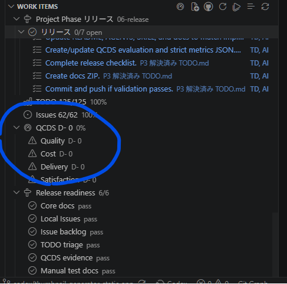

# QCDS評価のCode Starter可視化

- Status: closed
- Priority: P2
- Type: feature
- Source: local
- Draft source: codex-cli
- Phase: 04-implementation
- Created: 2026-06-07
- QCDS: Quality, Cost, Delivery, Satisfaction

## Context

現在、VS Code 上では QCDS 評価が D- と表示されている。QCDS 評価を実施し、その結果が VS Code の Code Starter 上で確認できるように可視化する。既存の指定に従い、機能実装として扱う。

## Acceptance Criteria

- [x] QCDS の各観点について評価結果が整理されている
- [x] VS Code の Code Starter 上で QCDS 評価が可視化される
- [x] 現在の D- 評価の根拠または改善後評価が確認できる
- [x] 可視化結果から Quality、Cost、Delivery、Satisfaction の状態を判別できる

## Attachments

## Notes

- Closed on 2026-06-07.
- Added `docs/qcds-code-starter-summary.md` and `docs/qcds-code-starter-summary.json` as the Code Starter-facing source of truth.
- Current visible result is `QCDS A+` with axis label `Q:A+ C:A+ D:A+ S:A+`.
- The previous `D-` was treated as an unevaluated/open-work-item fallback because the selected issue had QCDS axis names but no work-item-linked rating artifact.
- QCDS remains Quality A+, Cost A+, Delivery A+, and Satisfaction A+ based on `docs/qcds-evaluation.md` and `docs/qcds-strict-metrics.json`.
- Validation passed with `npm test`, `npm run build`, and the existing Playwright headless Chromium runtime gate evidence recorded in `docs/test-plan.md`.

## Codex Sessions

- 2026-06-07T13:09:45.388Z `codex-session-20260607130945-63qdoi` - Work Item: QCDS評価のCode Starter可視化 (VS Code Codex handoff); access=danger-full-access; model=gpt-5.5; intelligence=high; [prompt](c:/Users/gkkjh/AppData/Roaming/Code/User/workspaceStorage/57ceaa8249d2f65368a0891ad39aa21f/sunmax0731.codex-friendly-project-starter/first-prompt-20260607T130945Z.md)
