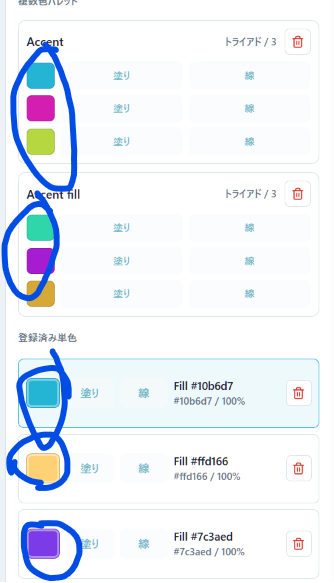

# Colorsタブからブランドキットカラーを登録する

- Status: closed
- Priority: P2
- Type: feature
- Source: local
- Draft source: codex-cli
- Phase: 03-design
- Created: 2026-06-07
- QCDS: Cost, Satisfaction

## Context

Colorsタブの登録済みパレットや単色を、ブランドキットセクションのカラーとして登録できる仕組みを追加する。改修対象はブランドキット側またはColorsタブ側のどちらでもよいが、既存の色サムネイル操作から自然に登録先を選べるUIにする。例として、Colorsタブ内の色サムネイルをクリックしたときに登録対象を選択するメニューを表示し、ブランドキットカラーへ追加できるようにする。

## Acceptance Criteria

- [x] Colorsタブの登録済みパレットまたは単色から、ブランドキットのカラーへ登録できる。
- [x] 色サムネイルなど既存UI上の自然な操作から、登録対象を選択できるメニューまたは同等の導線が表示される。
- [x] 登録したカラーがブランドキットセクションに反映され、以後の編集や利用で選択できる。
- [x] 既存のColorsタブおよびブランドキットの主要操作が壊れていないことを確認する。

## Attachments

## Notes

- Closed on 2026-06-08. Colors can register the active palette preview, saved palette colors, or registered single colors into Brand kit Primary, Accent, or Shadow. Runtime gate verified Primary registration status.

## Codex Sessions

- 2026-06-07T20:47:49.843Z `codex-session-20260607204749-jfakwr` - All Work Items (VS Code Codex handoff); access=danger-full-access; model=gpt-5.5; intelligence=high; [prompt](c:/Users/gkkjh/AppData/Roaming/Code/User/workspaceStorage/57ceaa8249d2f65368a0891ad39aa21f/sunmax0731.codex-friendly-project-starter/first-prompt-20260607T204749Z.md)
