# Screenshot Feature Guide

この資料は `dist/assets/screenshot/` に保管された画面キャプチャを元に、Thumbnail Generator の主要機能と代表的な作業手順を説明します。コミット後も画像参照が壊れないよう、使用画像は `docs/assets/screenshot-guide-*.png` にコピーして参照しています。

## 画面全体

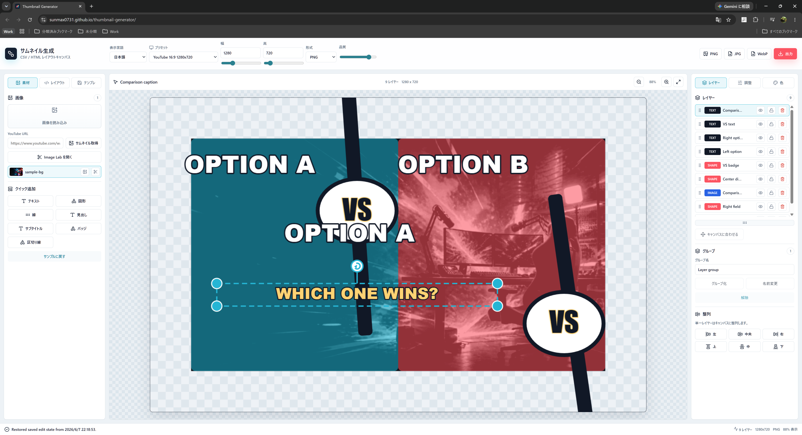

エディタは上部ツールバー、左の作業パネル、中央キャンバス、右のインスペクターで構成されます。

- 上部ツールバー: 表示言語、テーマ、編集状態アイコンを操作します。プレビュー上部ではプリセット、幅、高さ、出力メニューを操作します。JPG/PNG/WebP/OBSプレビューは出力メニューから選びます。
- 左パネル: 素材、レイアウト、テンプレの各タブで入力や再利用を操作します。
- 中央キャンバス: サムネイルのプレビュー、選択、移動、リサイズ、回転を操作します。
- 右インスペクター: レイヤー、調整、色の各タブでレイヤー順序や詳細値を編集します。
- 下部ステータス: 保存復元、選択解除、インポート、出力などの結果を表示します。

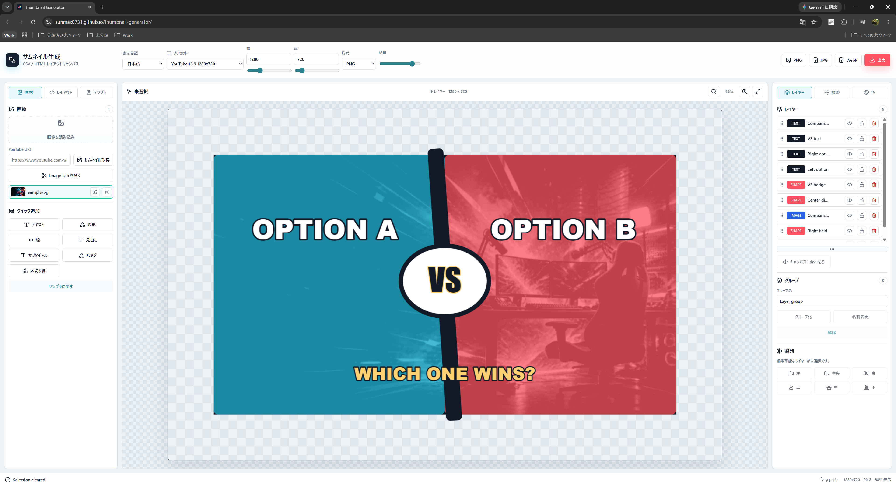

キャンバスの空白をクリックすると選択が解除されます。未選択時は右パネルの一部操作が無効化され、誤って対象外のレイヤーを編集しにくくなります。

## 基本ユースケース: テンプレートから作成する

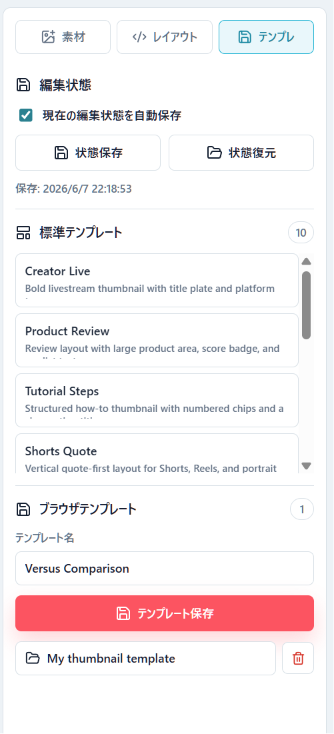

1. 左パネルで **テンプレ** を開きます。
2. **標準テンプレート** から目的に近いレイアウトを選びます。
3. 必要に応じて **編集状態** の自動保存を有効にします。
4. 再利用したい状態は **ブラウザテンプレート** に名前を付けて保存します。

標準テンプレートは 38 種類です。YouTube、Shorts、Stream、Cutout、Schedule、Motion のフィルタで絞り込み、標準テンプレート一覧とブラウザテンプレート一覧の下にあるハンドルで表示領域の高さを変えられます。

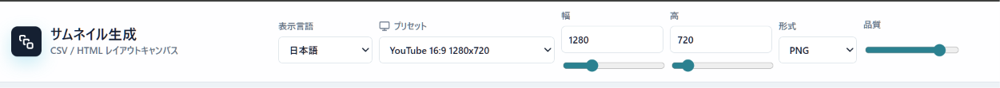

テンプレートを読み込んだあと、プレビュー上部で出力プリセット、幅、高さを確認します。YouTube 16:9 なら `1280x720`、Shorts 向けなら縦長プリセットを使います。形式は出力メニューの JPG/PNG/WebP から選びます。

## 基本ユースケース: 素材を追加して編集する

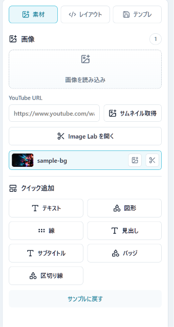

1. 左パネルで **素材** を開きます。
2. **画像を読み込み** からローカル画像を追加するか、YouTube URL を入力して **サムネイル取得** を使います。
3. 素材行の画像追加ボタンで画像レイヤーを作成します。
4. **クイック追加** からテキスト、図形、線、見出し、サブタイトル、バッジ、区切り線を追加します。
5. 必要に応じて素材行のはさみボタンから Image Lab を開き、切り抜きやクロマキー処理を行います。

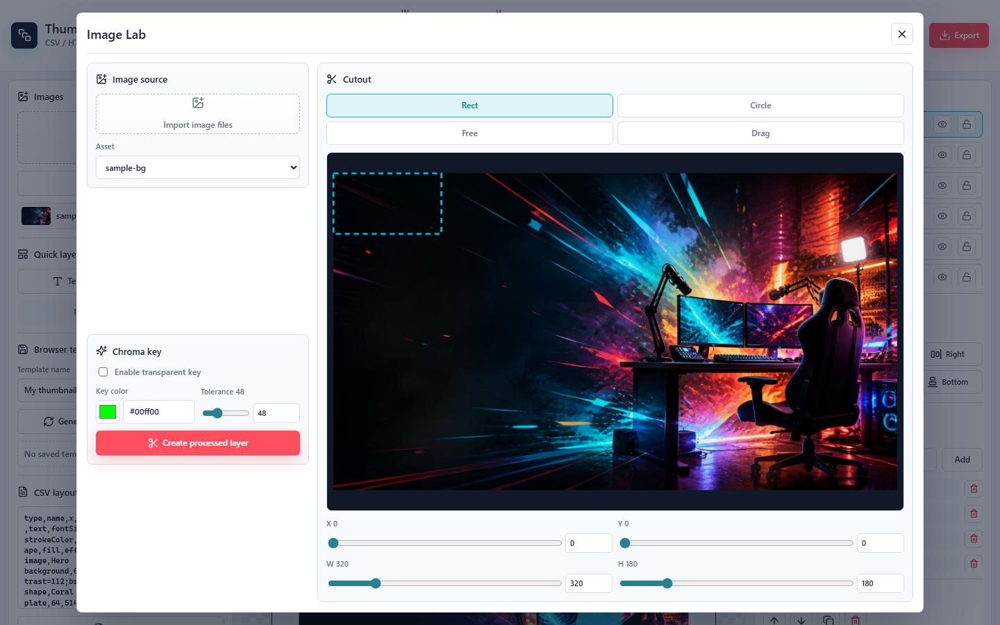

Image Lab は画像処理用のモーダルです。素材行から選んだ画像に対して、クロマキー、矩形、円、ポリゴンの切り抜きを設定して、処理済み画像を新しい画像レイヤーとして追加できます。

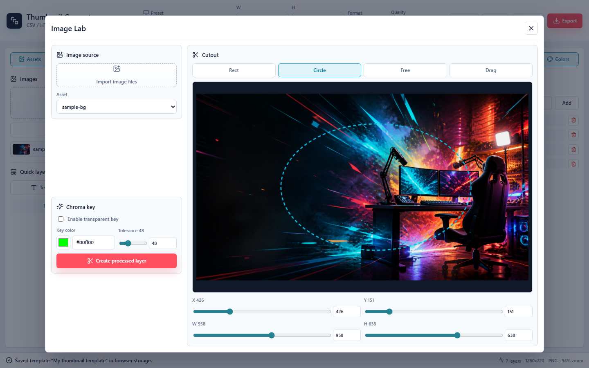

矩形と円の切り抜きはプレビュー上で直接ドラッグして範囲を作れます。作成後はハンドルで移動やリサイズを調整します。

## 基本ユースケース: キャンバス上でレイアウトを整える

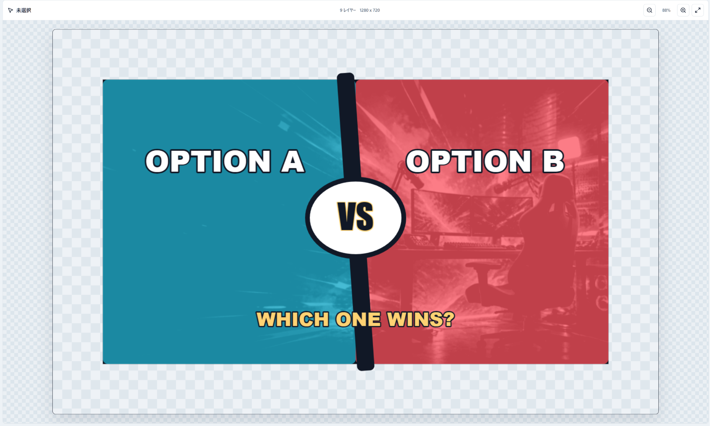

1. キャンバス上のレイヤーをクリックして選択します。
2. 選択中レイヤーをドラッグして移動します。
3. 角のハンドルでサイズを変更します。
4. 上側の回転ハンドルで角度を調整します。
5. Ctrl、Meta、Shift を押しながらクリックすると複数選択できます。
6. 空白をクリックすると選択解除できます。

編集時はキャンバス外にはみ出した要素やハンドルも表示されます。ただし、出力画像は設定した幅と高さの範囲にクリップされます。

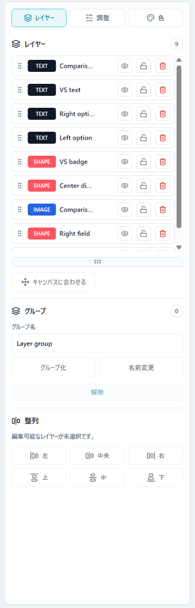

右パネルの **レイヤー** では、上から順に前面へ重なるレイヤーが表示されます。各行で表示/非表示、ロック、削除を操作できます。複数選択時はグループ化、名前変更、解除、整列を使ってまとまった構成を管理します。

## 基本ユースケース: 文字・画像・図形を調整する

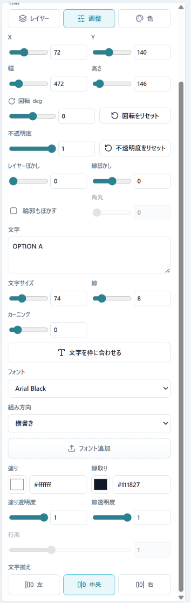

テキストレイヤーを選択して **調整** を開くと、名前、位置、サイズ、回転、ぼかし、文字列、文字サイズ、線、カーニング、フォント、組み方向、塗り、縁取り、文字揃えを編集できます。**文字を枠に合わせる** は、レイヤー範囲に収まる最大文字サイズを自動設定します。

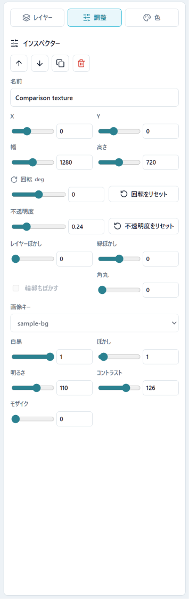

画像レイヤーでは、画像キー、白黒、ぼかし、明るさ、コントラスト、モザイクなどを編集できます。背景画像を大きく敷く場合は、レイヤーを選択して **キャンバスに合わせる** を使うと出力サイズに合わせやすくなります。

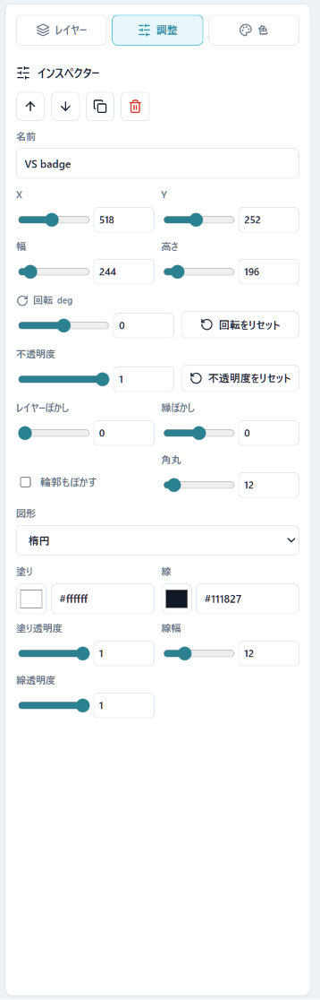

図形レイヤーでは、線幅、図形種別、角丸、塗り、線を編集できます。扇形を選んだ場合は、時計式の開始角度、終了角度、内径率で円グラフ状の領域やドーナツ状の扇形を調整できます。塗りと線の色表示をクリックすると、ドラッグ移動できるポップアップ単色ピッカーで色と透明度をまとめて設定できます。バッジや区切り線は、サムネイル内の注目箇所や構造を作るために使います。

## 基本ユースケース: CSV/HTML でレイアウトを再利用する

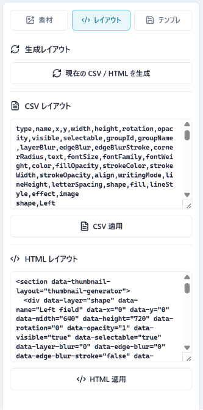

1. 左パネルで **レイアウト** を開きます。
2. **現在の CSV / HTML を生成** を選択すると、現在のレイヤー構成がテキスト化されます。
3. CSV レイアウトまたは HTML レイアウトを編集または貼り付けます。
4. **CSV 適用** または **HTML 適用** を選ぶと、読み込んだ内容でレイヤー構成が置き換わります。

CSV/HTML は、同じ構成を別サムネイルへ流用したい場合や、外部ツールでレイヤー定義を生成したい場合に使います。

## 基本ユースケース: 色を登録して適用する

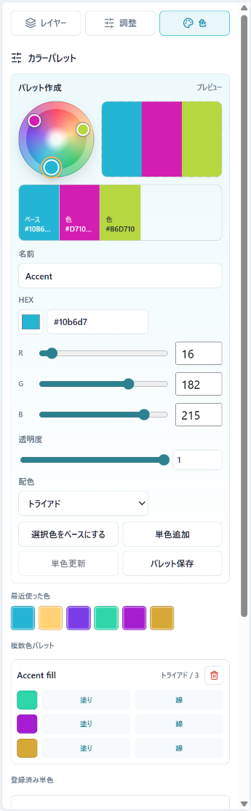

**色** タブでは、HEX/RGB、透明度、配色パターンを調整しながら配色を作成できます。カラーホイールの点を選択またはドラッグすると、トライアドなどの配色パターンに沿って候補色が更新されます。

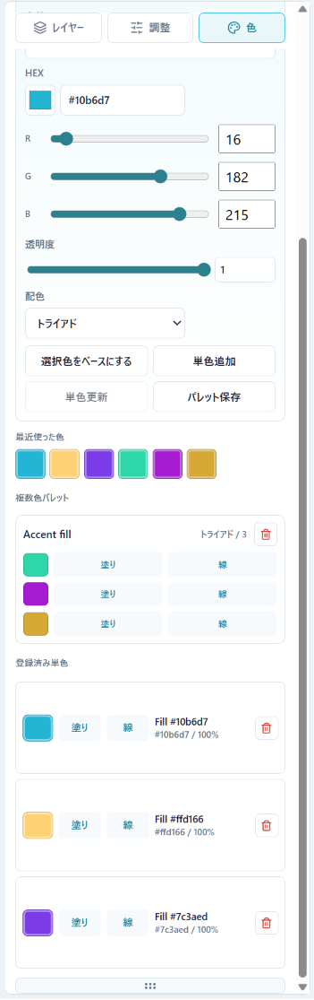

作成した色は **単色追加** で登録できます。登録済み単色や保存済みパレットの各色には **塗り** と **線** の適用ボタンがあり、選択中のテキストまたは図形へ直接反映できます。

## 基本ユースケース: 出力する

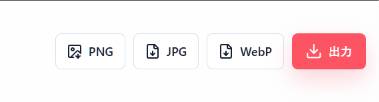

1. プレビュー下部の PNG、JPG、WebP ボタンから出力したい形式を直接選びます。
2. 最高品質でブラウザのダウンロードとしてサムネイル画像が保存されます。

出力はブラウザ内の canvas で生成されます。サーバー送信やアカウント登録は不要です。

## キャプチャ対応表

| 説明 | 資料内画像 | 元キャプチャ |
| --- | --- | --- |
| 選択中の全体画面 | `docs/assets/screenshot-guide-full-editor-selected.png` | `dist/assets/screenshot/スクリーンショット 2026-06-07 223840.png` |
| 未選択の全体画面 | `docs/assets/screenshot-guide-full-editor-cleared.png` | `dist/assets/screenshot/スクリーンショット 2026-06-07 223858.png` |
| 素材タブ | `docs/assets/screenshot-guide-assets.png` | `dist/assets/screenshot/スクリーンショット 2026-06-07 223928.png` |
| レイアウトタブ | `docs/assets/screenshot-guide-layouts.png` | `dist/assets/screenshot/スクリーンショット 2026-06-07 223940.png` |
| テンプレタブ | `docs/assets/screenshot-guide-templates.png` | `dist/assets/screenshot/スクリーンショット 2026-06-07 223953.png` |
| 出力設定 | `docs/assets/screenshot-guide-output-settings.png` | `dist/assets/screenshot/スクリーンショット 2026-06-07 224010.png` |
| 出力ボタン | `docs/assets/screenshot-guide-export-buttons.png` | `dist/assets/screenshot/スクリーンショット 2026-06-07 224021.png` |
| キャンバス | `docs/assets/screenshot-guide-canvas.png` | `dist/assets/screenshot/スクリーンショット 2026-06-07 224037.png` |
| レイヤータブ | `docs/assets/screenshot-guide-layers.png` | `dist/assets/screenshot/スクリーンショット 2026-06-07 224048.png` |
| テキスト調整 | `docs/assets/screenshot-guide-adjust-text.png` | `dist/assets/screenshot/スクリーンショット 2026-06-07 224119.png` |
| 色作成 | `docs/assets/screenshot-guide-colors-maker.png` | `dist/assets/screenshot/スクリーンショット 2026-06-07 224135.png` |
| 保存済み色 | `docs/assets/screenshot-guide-colors-saved.png` | `dist/assets/screenshot/スクリーンショット 2026-06-07 224148.png` |
| 画像調整 | `docs/assets/screenshot-guide-adjust-image.png` | `dist/assets/screenshot/スクリーンショット 2026-06-07 224210.png` |
| 図形調整 | `docs/assets/screenshot-guide-adjust-shape.png` | `dist/assets/screenshot/スクリーンショット 2026-06-07 224222.png` |
